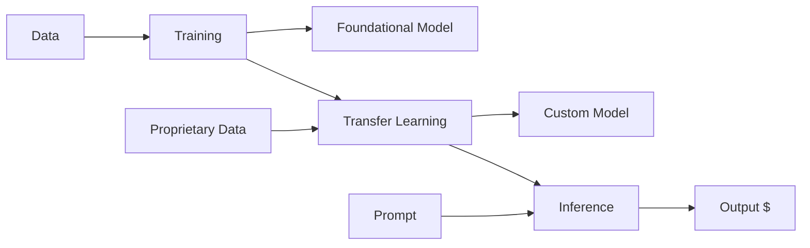

### Hi there 👋

I'm a seasoned professional with more than two decades of experience in leading software development projects and shaping technical visions. I've had the pleasure of working with a wide range of entities, from agile startups to large corporations, where I've successfully scaled teams and delivered innovative solutions. Recently, I completed a master's degree in Machine Learning and Data Science, which has fueled my excitement for combining cloud services and AI to help businesses stay ahead of the curve and unlock the incredible potential of technology

### Currently 
I am deeply engrossed in the captivating realm of generative artificial intelligence. My current endeavors revolve around delving into LLM MLOPs and LangChain, aiming to craft intelligent agents and robots that amplify the potential of AI to enhance human experiences. It's an exciting journey as I explore innovative ways to leverage these technologies and empower individuals to maximize the benefits of AI.

### Previously ... [ LinkedIn](https://www.linkedin.com/in/tzoght/)
* Demonstrated engineering leadership and operational excellence in diverse software development projects, utilizing a wide range of skills including Linux, C, C++, Java, C#, JavaScript, Python, and GoLang.
* Advocated for and implemented Agile software development methodologies, ensuring efficient and collaborative workflows at scale. Successfully integrated DevOps practices to streamline development processes.
* Managed release processes and product launches, ensuring smooth deployments and timely deliveries.
* Leveraged cloud platforms and effectively deployed and orchestrated containers using Docker and Kubernetes, enabling scalable and resilient infrastructure.
* Actively contributed to the telecom and network management landscapes by providing innovative features and enhancements, improving the functionality and efficiency of messaging platforms, ultimately benefiting telecom customers and end-users.

---
 
 

  
  
  

You can find me on [ LinkedIn](https://www.linkedin.com/in/tzoght/)
